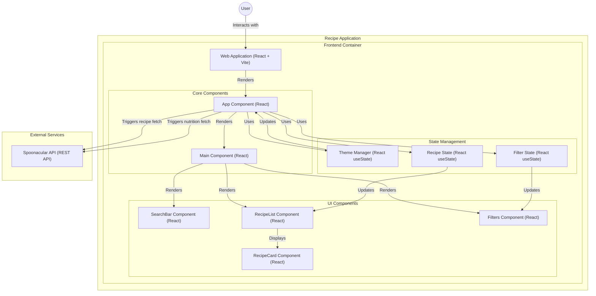

## Instalación
Para instalar y ejecutar la aplicación localmente, sigue estos pasos:

1. **Clona el repositorio**:
   ```bash
   git clone https://github.com/tu-usuario/recipe-app.git
   cd recipe-app
   ```

2. **Instala las dependencias**:
   ```bash
   npm install
   ```

3. **Inicia la aplicación**:
   ```bash
   npm run dev
   ```

   La aplicación estará disponible en [http://localhost:3000](http://localhost:3000).

---

## Uso

1. **Ingresa los ingredientes** que tienes disponibles en la barra de búsqueda.
2. **Filtra las recetas** por tiempo de preparación, tipo de dieta, o por orden de calorías.
3. **Haz clic en una receta** para ver más detalles, incluyendo la información nutricional.

---

## Componentes Principales

- **AppComponent**: Componente principal que maneja el estado global de la aplicación.
- **MainComponent**: Componente que contiene los componentes de la interfaz de usuario.
- **SearchBar**: Componente para buscar recetas por ingredientes.
- **RecipeList**: Componente que muestra la lista de recetas.
- **RecipeCard**: Componente que muestra la información de una receta individual.
- **Filters**: Componente para aplicar filtros a las recetas.
- **ThemeState**: Estado para manejar el tema (claro/oscuro).
- **RecipeState**: Estado para manejar las recetas obtenidas.
- **FilterState**: Estado para manejar los filtros aplicados.

---

## API

La aplicación utiliza la **API de Spoonacular** para obtener información sobre las recetas y su información nutricional.
