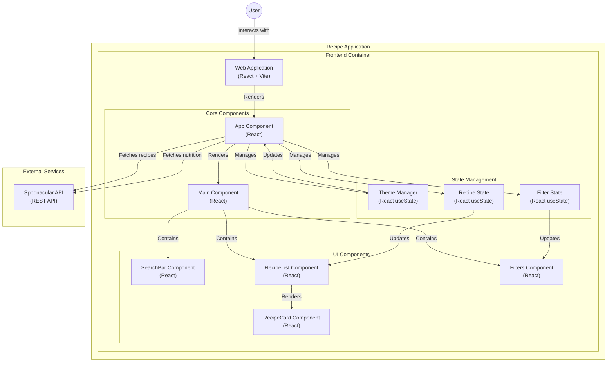

# Diagrama

```mermaid
graph TB
    User((User))

    subgraph "Recipe Application"
        subgraph "Frontend Container"
            WebApp["Web Application<br>(React + Vite)"]
            
            subgraph "Core Components"
                AppComponent["App Component<br>(React)"]
                MainComponent["Main Component<br>(React)"]
            end
            
            subgraph "UI Components"
                SearchBar["SearchBar Component<br>(React)"]
                RecipeList["RecipeList Component<br>(React)"]
                RecipeCard["RecipeCard Component<br>(React)"]
                Filters["Filters Component<br>(React)"]
            end
            
            subgraph "State Management"
                ThemeState["Theme Manager<br>(React useState)"]
                RecipeState["Recipe State<br>(React useState)"]
                FilterState["Filter State<br>(React useState)"]
            end
        end
    end

    subgraph "External Services"
        SpoonacularAPI["Spoonacular API<br>(REST API)"]
    end

    %% User interactions
    User -->|"Interacts with"| WebApp
    
    %% Main component relationships
    WebApp -->|"Renders"| AppComponent
    AppComponent -->|"Renders"| MainComponent
    
    %% UI Component relationships
    MainComponent -->|"Contains"| SearchBar
    MainComponent -->|"Contains"| RecipeList
    MainComponent -->|"Contains"| Filters
    RecipeList -->|"Renders"| RecipeCard
    
    %% State management
    AppComponent -->|"Manages"| ThemeState
    AppComponent -->|"Manages"| RecipeState
    AppComponent -->|"Manages"| FilterState
    
    %% External API interactions
    AppComponent -->|"Fetches recipes"| SpoonacularAPI
    AppComponent -->|"Fetches nutrition"| SpoonacularAPI
    
    %% State to component relationships
    RecipeState -->|"Updates"| RecipeList
    FilterState -->|"Updates"| Filters
    ThemeState -->|"Updates"| AppComponent
```